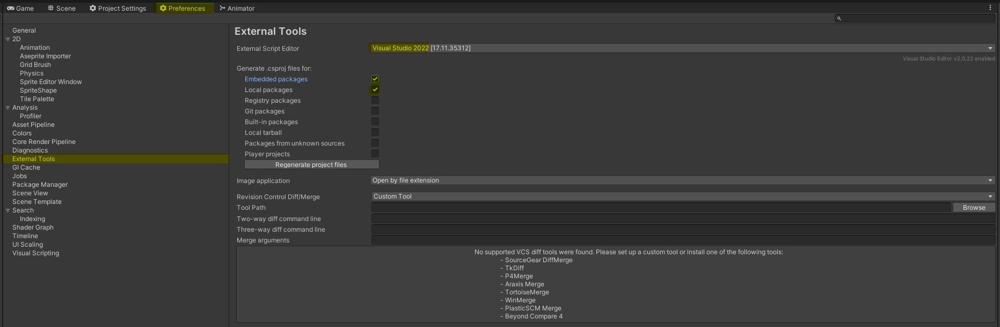
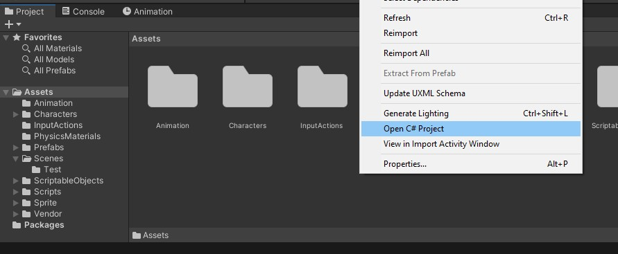

### Первый запуск visual studio {docsify-ignore-all}

!> Обновить студию до последней версии. После всех настроек, желательно перезапустить студию, могут проблемы / конфликты с правилами из `.editorconfig`

### Подключение IDE к Unity

?>
В `Preferences` > `External Tools` выбрать `visual studio`  
Нажать кнопку `Regenerate projects files`

?> Запуск `.sln` через выбранный редактор (приоритетный запуск, т.к. голый запуск может терять контент или `NuGet`)

