## Подключение IDE к Unity

?>
В `Preferences` > `External Tools` выбрать `visual studio`  
Нажать кнопку `Regenerate projects files`

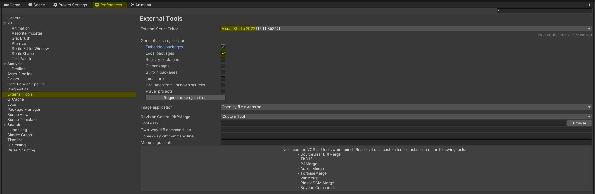

?> Запуск `.sln` через выбранный редактор (приоритетный запуск, т.к. голый запуск может терять контент или `NuGet`)

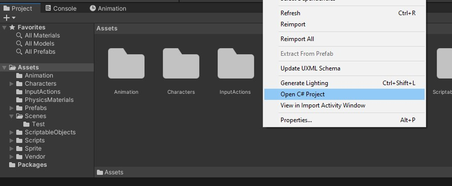

## Первый запуск visual studio

!> Обновить студию до последней версии. После всех настроек, желательно перезапустить студию, могут проблемы / конфликты с правилами из `.editorconfig`

## Code cleanup (форматирование и исправление)

> [список правил `Code cleanup` от Microsoft](https://learn.microsoft.com/en-us/visualstudio/ide/code-styles-and-code-cleanup?view=vs-2022#code-cleanup-settings)

?>
**en**: Tools > Options > Text Editor > Code Cleanup  
**ru**: Средства > Параметры > Текстовый редактор > Очистка кода

-   включить пункт `Запустить профиль "Очистка кода" при сохранении` | `Run Code Cleanup profile on save`

    <details>
      <summary>Результат RU</summary>
      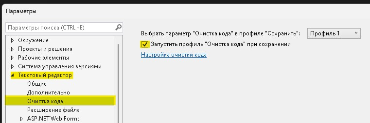
    </details>
    <details>
      <summary>Результат EN</summary>
      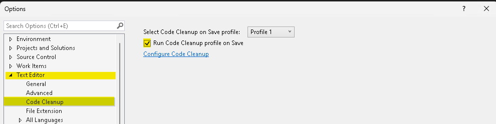
    </details>

-   в настройках очистки кода добавить **ВСЕ ПРАВИЛА**, кроме:

    <details>
      <summary>Результат RU</summary>
      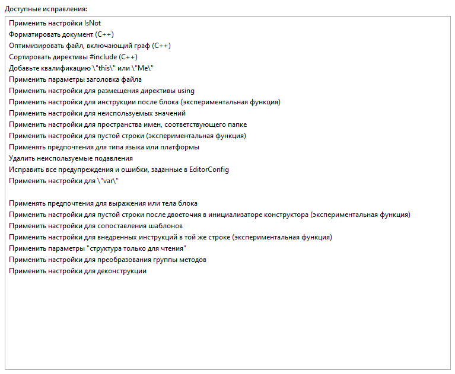
    </details>
    <details>
      <summary>Результат EN</summary>
      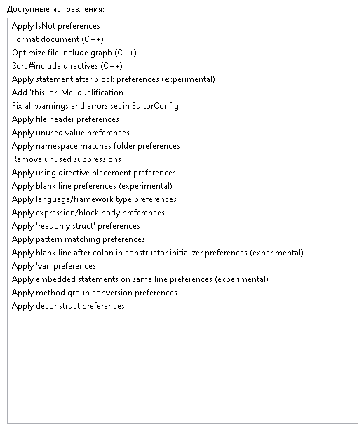
    </details>

### Дополнительные настройки (опционально, т.к. все остальное настроено в `.editorconfig`)

-   включить подсказки для неявно типизированных, локальных переменных (`var`, `new()`) и входных параметров метода / функции

    <details>
      <summary>Настройка и пример</summary>
      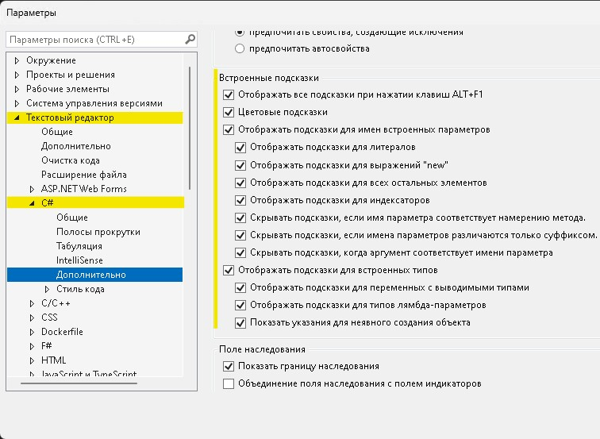
      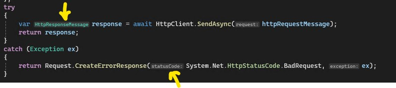
    </details>

-   сортировка ошибок по кодам: вкладка "список ошибок" > правый клик > группирование > код

    <details>
      <summary>Настройка</summary>
      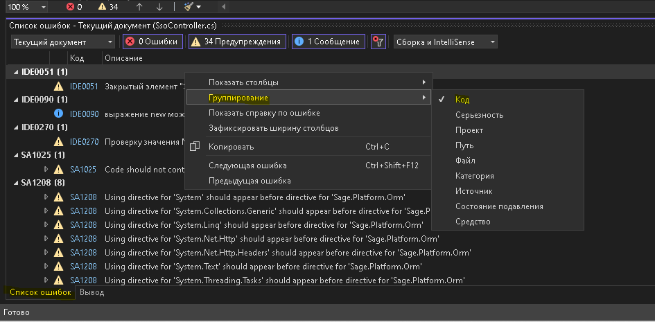
    </details>

## Item Template (шаблоны для файлов)

?>
**en**: Tools > Options > Projects and Solutions > Locations  
**ru**: Средства > Параметры > Проекты и решения > Расположения

-   пункт `User item template location` | `Расположение шаблонов элементов пользователя`
-   выбрать папку `TemplateItem` в `/путь к репозиторию кода game/` + `/.ide/TemplateItem`
-   перезагрузить `visual studio`

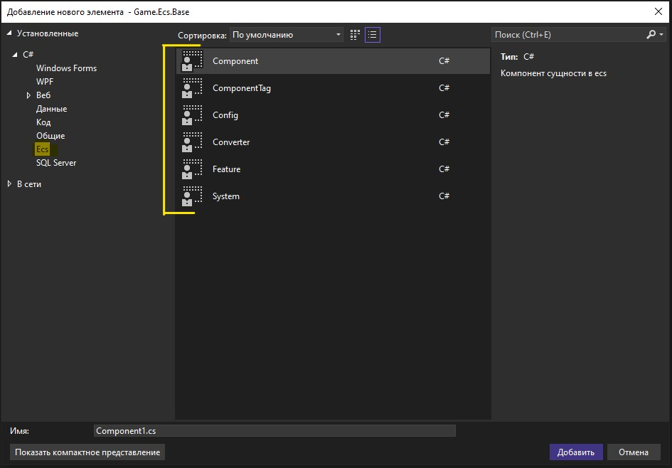

## Code Snippets (шаблоны для кода)

> [Пошаговое руководство. Создание фрагмента кода в Visual Studio](https://learn.microsoft.com/ru-ru/visualstudio/ide/walkthrough-creating-a-code-snippet?view=vs-2022)

?>
**en**: Tools > Code Snippets Manager  
**ru**: Средства > Диспетчер фрагментов кода

-   пункт `Import`
-   выбрать **ВСЕ ЭЛЕМЕНТЫ** в `/путь к репозиторию кода game/` + `/.ide/Code Snippets`
-   если уже есть такие файлы, перезаписать (делать каждый раз при обновлении сниппетов)

?> Дополнительно можно сделать постоянное обновление `Code Snippets` если в настройках указать папку со `Code Snippets`

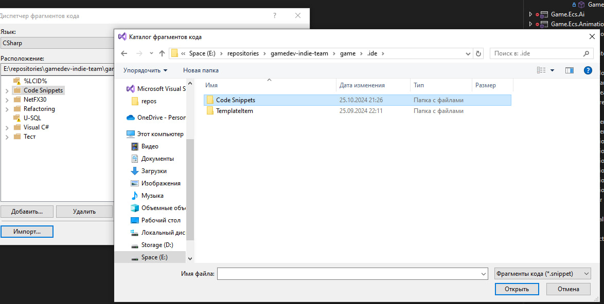

### Виды

-   `descEcsEventFactory`: описание фабрики событий модуля
-   `descEcsFactory`: описание фабрики модуля
-   `descEcsHelper`: описание помощника модуля
-   `descException`: описание `Exception` для объекта языка

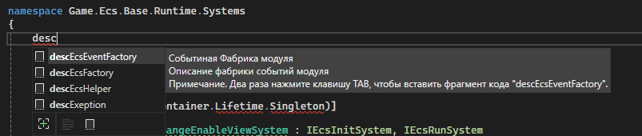

## Проверка орфографии

?>
**en**: Edit > Advanced > Toggle Spell Checker  
**ru**: Правка > Дополнительно > Переключить проверку орфографии

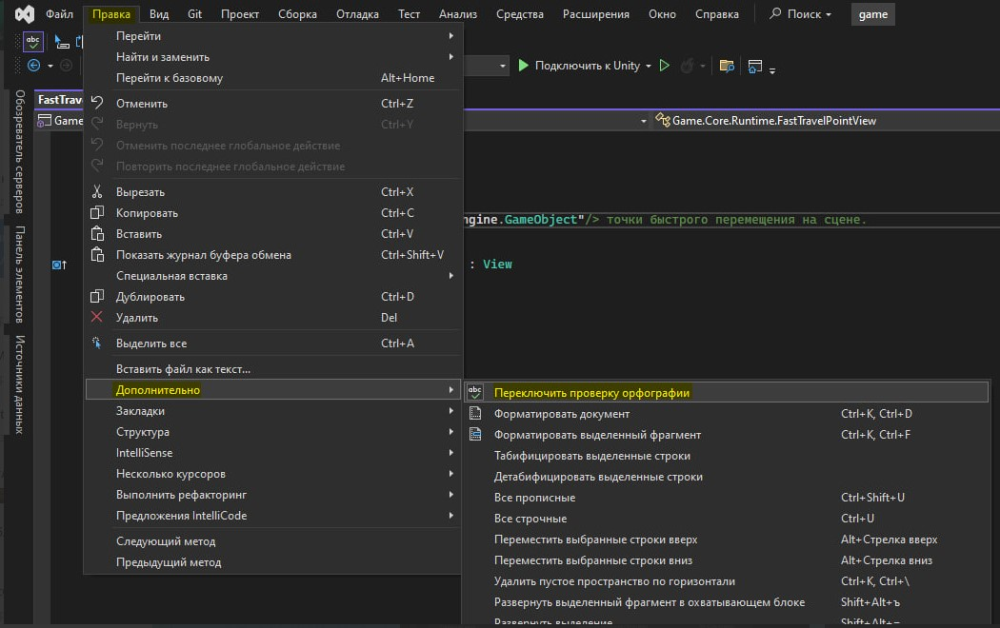

## Добавление `.editorconfig`

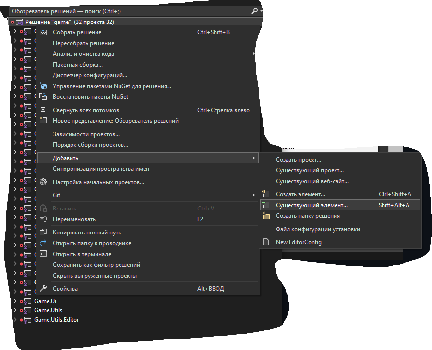

## Установка зависимостей

Этот пункт можно сделать 2 путями:

-   восстановление `NuGet`-пакетов  
    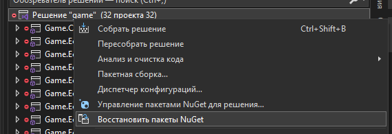

-   запустить `build` решения (`ctrl + shift + b`), создаться папка obj в корне, можно удалить
    ```powershell
    dotnet build .\game.sln
    ```

## Опционально

**Анализ кода**. Можно запускать как для всего решения, так и для проекта, удобно смотреть пропущенные `warning`

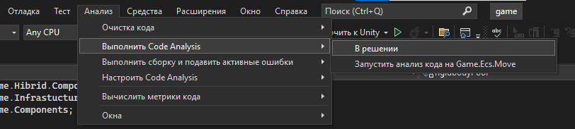

**Обозреватель решения**. Отслеживать активный элемент  
`Tools` > `Options` > `Project and Solutions` > `General` установить `Track Active Item in Solution Explorer`

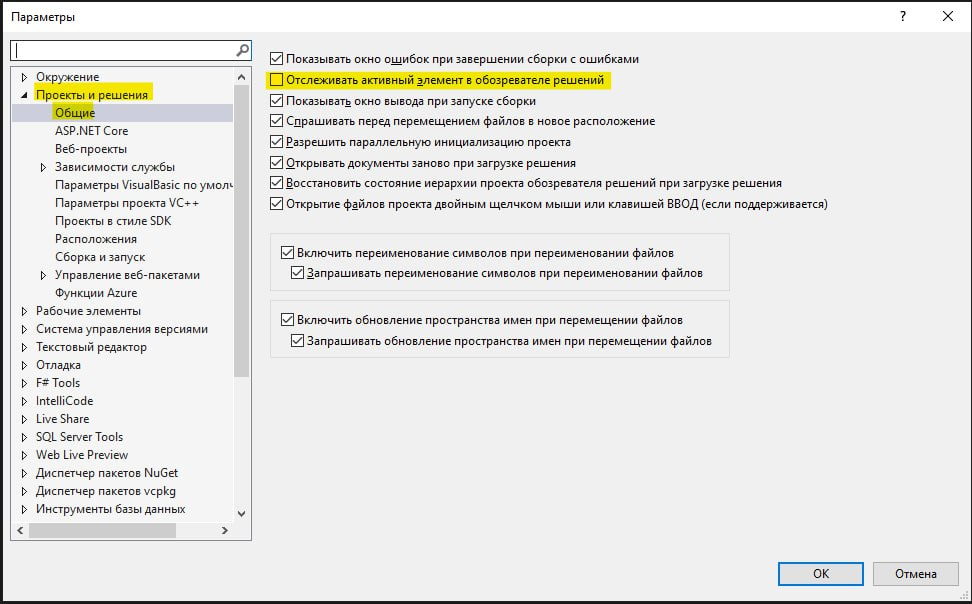

## Возможные проблемы

-   правила из `.editorconfig`, которые помечены как `none`, отображаются как `warning` в списке ошибок. Тут или перезапуск студии, либо само пройдет (бывает тупит)
-   **`Code Cleanup` НИКАК не экспортируется и не переносится**. Может случиться так, что при обновлении студии, пропадут настройки, тут придется опять настраивать руками
