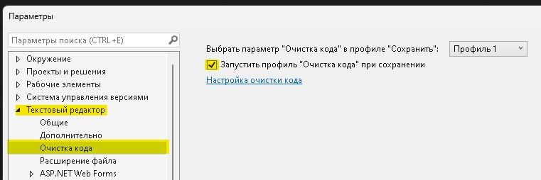
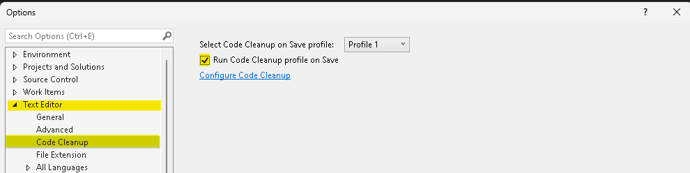
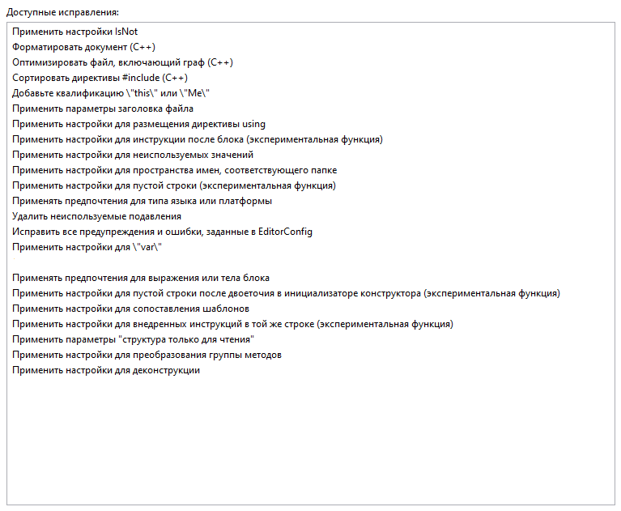
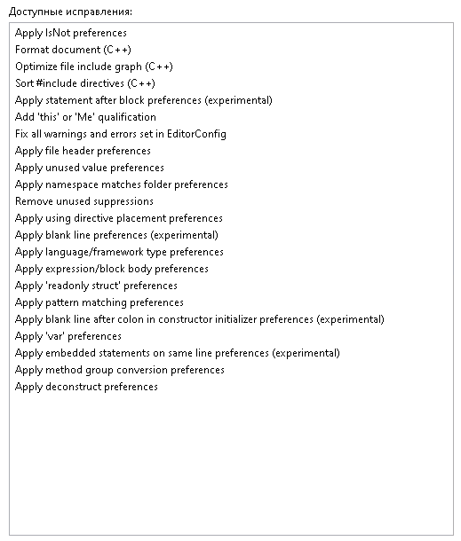

> [список правил `Code cleanup` от Microsoft](https://learn.microsoft.com/en-us/visualstudio/ide/code-styles-and-code-cleanup?view=vs-2022#code-cleanup-settings)

?>
**en**: Tools > Options > Text Editor > Code Cleanup  
**ru**: Средства > Параметры > Текстовый редактор > Очистка кода

- включить пункт `Запустить профиль "Очистка кода" при сохранении` | `Run Code Cleanup profile on save`

- в настройках очистки кода добавить **ВСЕ ПРАВИЛА**, кроме:

