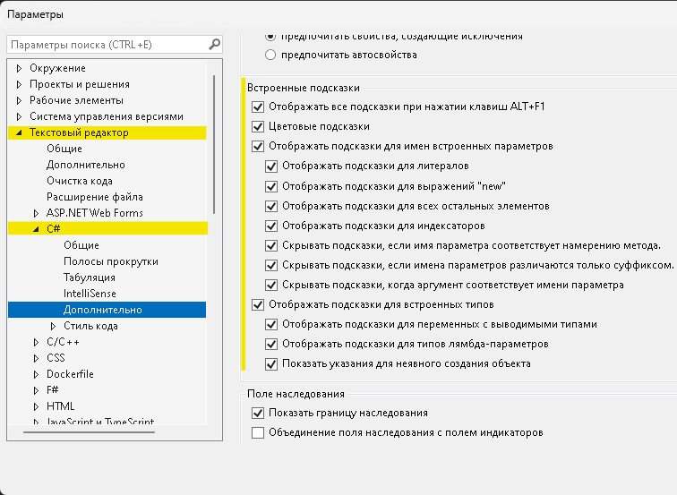
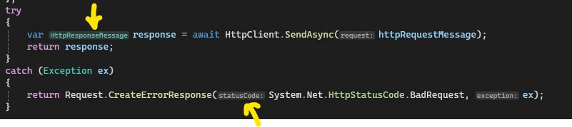
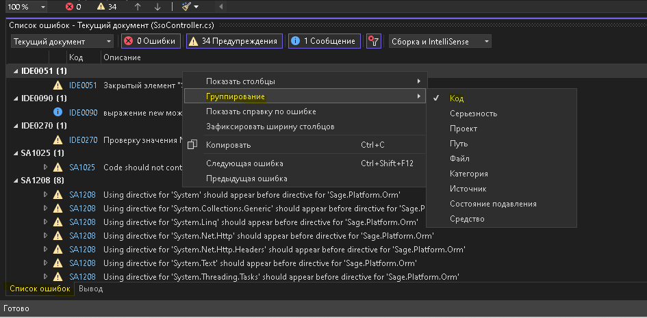
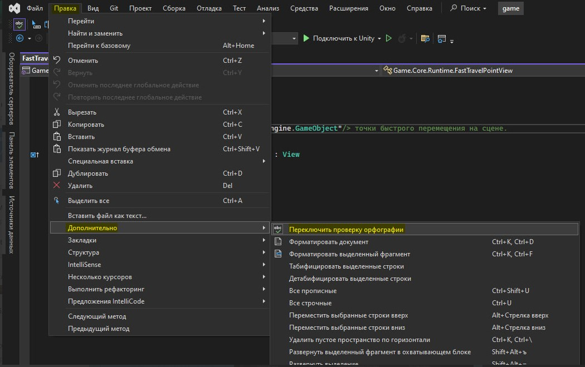
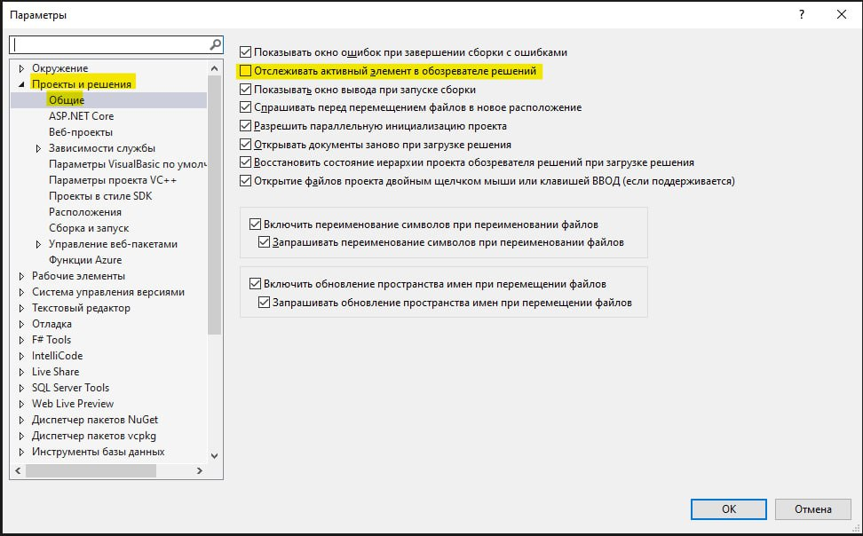
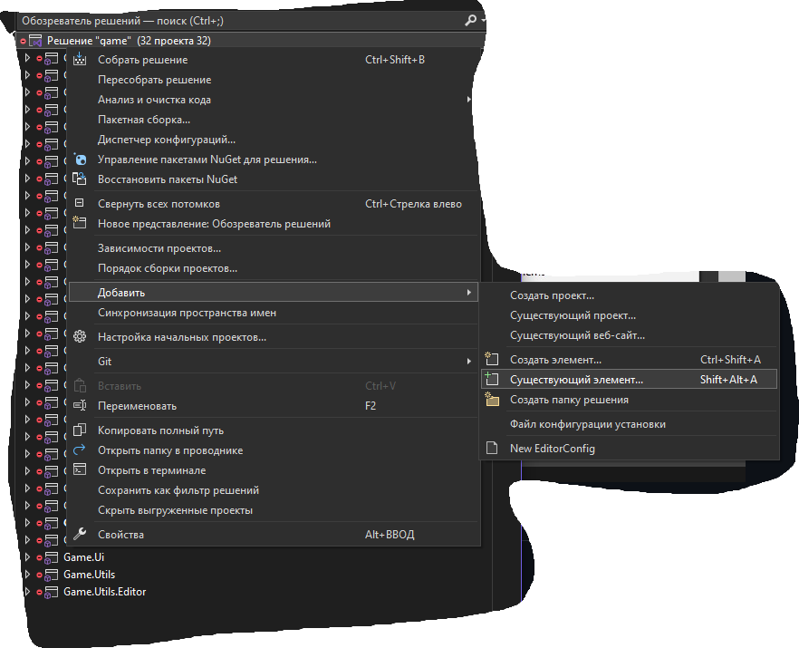
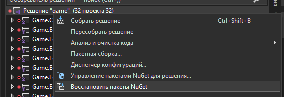
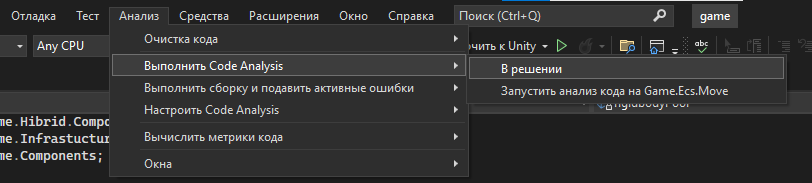

> Дополнительные настройки опционально, т.к. все остальное настроено в `.editorconfig`

### Включить подсказки для неявно типизированных, локальных переменных (`var`, `new()`) и входных параметров метода / функции





### Сортировка ошибок по кодам: вкладка "список ошибок" > правый клик > группирование > код



### Проверка орфографии

?>
**en**: Edit > Advanced > Toggle Spell Checker  
**ru**: Правка > Дополнительно > Переключить проверку орфографии



### Отслеживать активный элемент

?> Tools > Options > Project and Solutions > General установить Track Active Item in Solution Explorer



### Добавление `.editorconfig`

**В VS2026+ уже не обязательно**



### Установка зависимостей

Этот пункт можно сделать 2 путями:

- восстановление `NuGet`-пакетов

    

- запустить `build` решения (`ctrl + shift + b`), создаться папка obj в корне, можно удалить
    ```powershell
    dotnet build .\game.sln
    ```

### Анализ кода

Можно запускать как для всего решения, так и для проекта, удобно смотреть пропущенные `warning`


