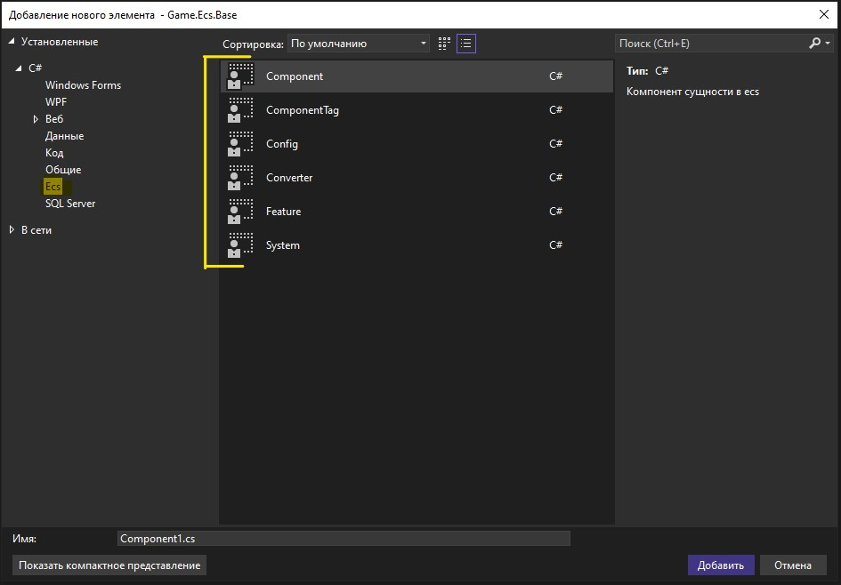
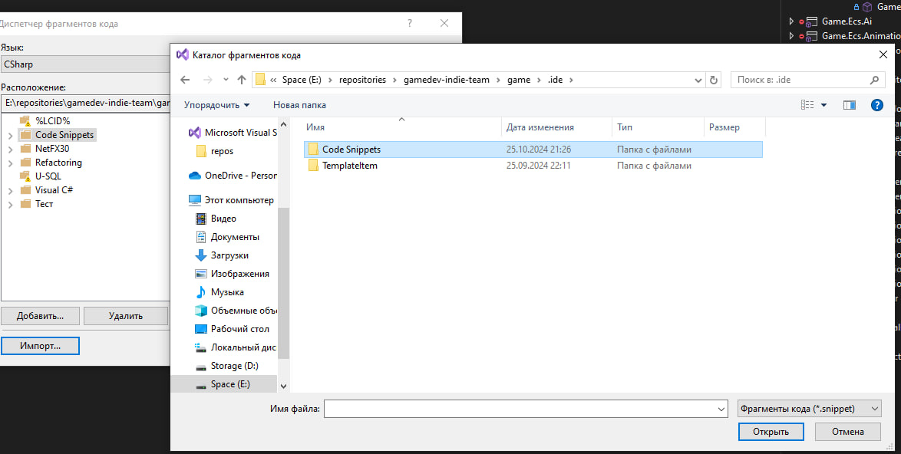
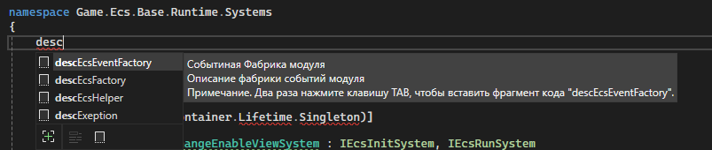

### Item Template (шаблоны для файлов)

?>
**en**: Tools > Options > Projects and Solutions > Locations  
**ru**: Средства > Параметры > Проекты и решения > Расположения

- пункт `User item template location` | `Расположение шаблонов элементов пользователя`
- выбрать папку `item-template` в `docs/visual-studio/_code`
- перезагрузить `visual studio`

### Code Snippets (шаблоны для кода)

> [Пошаговое руководство. Создание фрагмента кода в Visual Studio](https://learn.microsoft.com/ru-ru/visualstudio/ide/walkthrough-creating-a-code-snippet?view=vs-2022)

?>
**en**: Tools > Code Snippets Manager  
**ru**: Средства > Диспетчер фрагментов кода

- пункт `Import`
- выбрать **ВСЕ ЭЛЕМЕНТЫ** в `/путь к репозиторию кода game/` + `/.ide/Code Snippets`
- если уже есть такие файлы, перезаписать (делать каждый раз при обновлении сниппетов)

?> Дополнительно можно сделать постоянное обновление `Code Snippets` если в настройках указать папку со `Code Snippets`

### Виды

- `descEcsEventFactory`: описание фабрики событий модуля
- `descEcsFactory`: описание фабрики модуля
- `descEcsHelper`: описание помощника модуля
- `descException`: описание `Exception` для объекта языка

