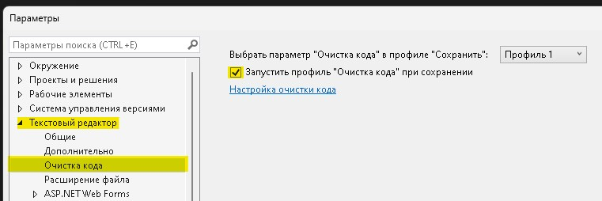
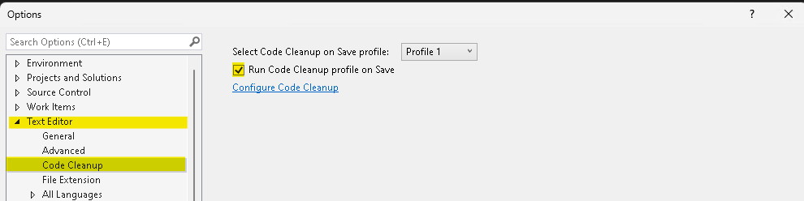
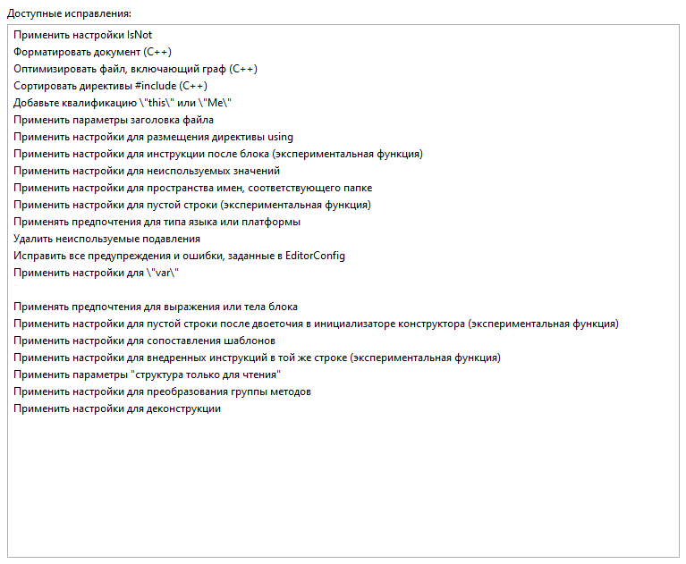
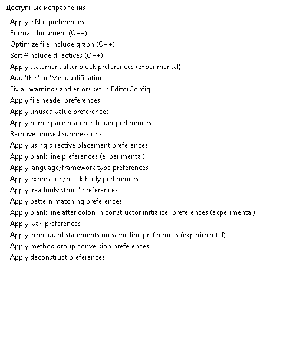
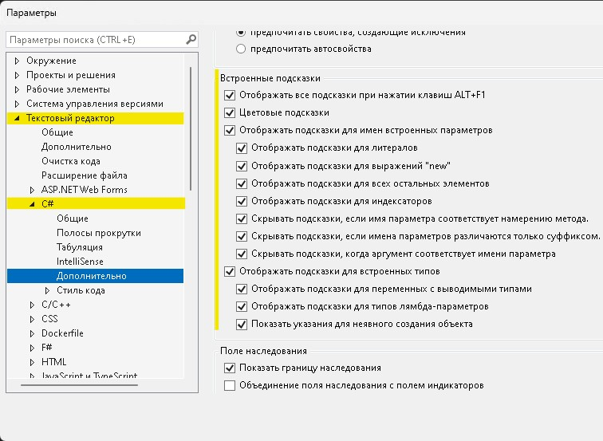
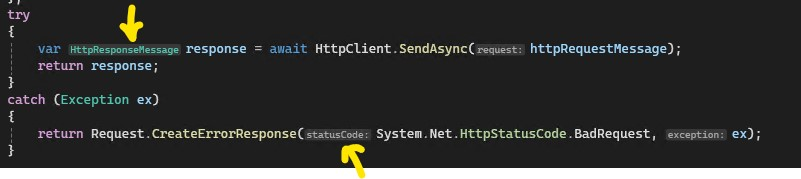
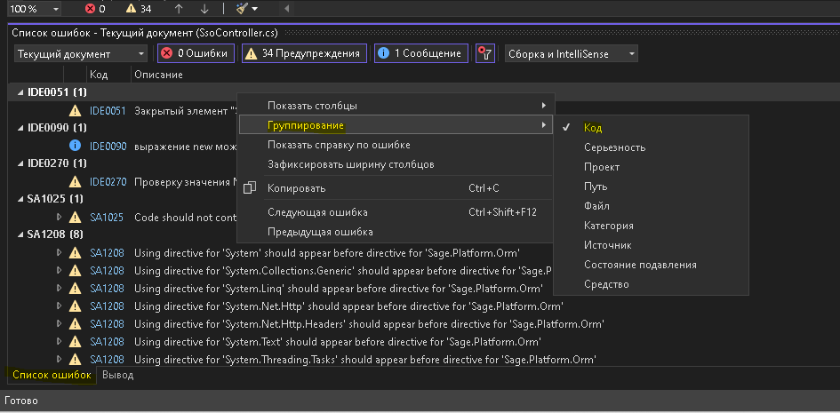

> после всех настроек, желательно перезапустить студию, могут проблемы / конфликты с правилами из `.editorconfig`

### Code cleanup

> Tools > Options > Text Editor > Code Cleanup  
> Средства > Параметры > Текстовый редактор > Очистка кода

> [список правил `Code cleanup` от Microsoft][1]

-   включить пункт `Запустить профиль "Очистка кода" при сохранении` | `Run Code Cleanup profile on save`
    

      
результат RU

      
      
    

    

      
результат EN

      
      
    

-   в настройках очистки кода добавить **`ВСЕ правила`**, кроме:
    

      
исключить RU

      
      
    

    

      
исключить EN

      
      
    

### Дополнительные настройки (опционально, т.к. все остальное настроено в `.editorconfig`)

-   включить подсказки для неявно типизированных, локальных переменных (`var`, `new()`) и входных параметров метода / функции
    

      
настройка

      
        
      
    

-   сортировка ошибок по кодам: вкладка "список ошибок" > правый клик > группирование > код
    

      
настройка

      
      
    

### Возможные проблемы

-   **правила из `.editorconfig`, которые помечены как `none`, отображаются как `warning` в списке ошибок**. Тут или перезапуск студии, либо само пройдет (бывает тупит)
-   **`Code Cleanup` НИКАК не экспортируется и не переносится**. Может случиться так, что при обновлении студии, пропадут настройки, тут придется опять настраивать руками

[1]: https://learn.microsoft.com/en-us/visualstudio/ide/code-styles-and-code-cleanup?view=vs-2022#code-cleanup-settings
